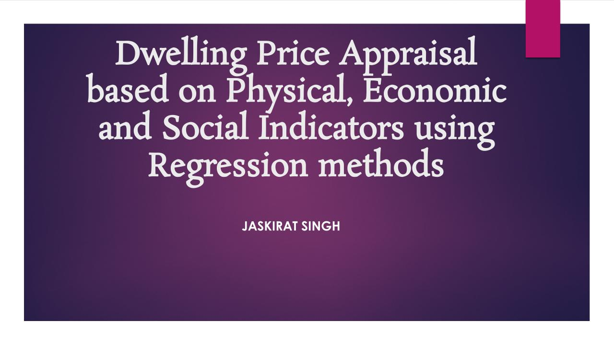

# Housing-Price-Prediction-using-Advanced-ML-Algorithms
Predicting housing price of King County, Washington DC using various Regression techniques and comparing the algorithms based on the    precision calculating parameters.

In this project, I am predicting the House price of the houses using various machine learning algorithms. Housing sales price are determined by numerous factors such as area of the property, location of the house, condition of the property, age of the property, number of bedrooms and bathrooms and so on. This project uses machine learning algorithms to build the prediction model for houses. Here, machine learning algorithms such as XG-Boost, Light-GBM, Random Forest Regression, Polynomial Regression, Decision Tree Regression, Multiple Linear Regression and KNN are employed to build a predictive model. I have considered housing data of 21613 properties. Cat Boost Regressor, XG-Boost , Gradient Boosting Regressor, Light-GBM, Random Forest Regression, Polynomial Regression, Decision Tree Regression , Multiple Linear Regression, Ada Boost Regressor and KNN  show the R-squared value of 0.911,0.903,0.909,0.903,0.888, 0.882,0.813, 0.80, 0.739, 0.690 ,0.687, 0.811 respectively. Further, I have compared these algorithms based on parameters such as mean of the R-squared values obtained by the k-Fold Cross Validation, Adjusted R-Square, R-Square and RMSE. This project also represents significance of my approach and the methodology.

Dataset Link: https://www.kaggle.com/harlfoxem/housesalesprediction

If you use results produced by my code in any publication, please cite my paper:
Jaskirat Singh, Puneet Kumar Aggarwal, Parita Jain. “Property Rate Forecast Using Machine Learning ”. Design Engineering, Aug. 2021, pp. 9927 -49, http://thedesignengineering.com/index.php/DE/article/view/3622.

